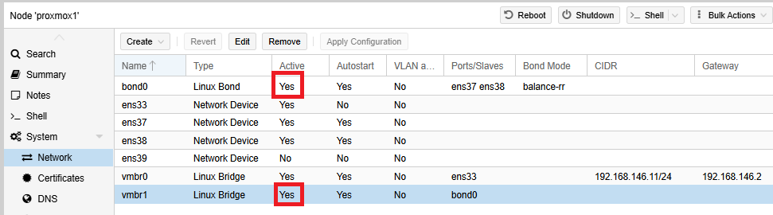

# Bonds

Bonding (NIC teaming, Link Aggregation) allows an administrator to bind multiple NICs to achieve either high availability/redundancy, and/or higher bandwidth. In standard Linux, interfaces can be bonded together in this way.

There are seven different modes in which this can be configured, on a live network I'll try to use IEEE802.3ad as long as my switching infrastructure supports it. I'm not going to cover link aggregation control protocol (LACP) here, but I do in my network modules. For more details, read [here](https://pve.proxmox.com/pve-docs/pve-admin-guide.html#sysadmin_network_configuration).

I am going to add ens38 and 39 to a net bond0, using a round-robin algorithm to load balance.

<figure><figcaption></figcaption></figure>

I then create a new bridge to use this bond.&#x20;

<figure><figcaption></figcaption></figure>

And finally, I apply the configuration.

<figure><figcaption></figcaption></figure>

The status changes to active for the bond and the bridge.

<figure><figcaption></figcaption></figure>

The configuration file is **/etc/network/interfaces** now appears as

```
auto lo
iface lo inet loopback

iface ens33 inet manual

auto ens37
iface ens37 inet manual

auto ens38
iface ens38 inet manual

iface ens39 inet manual

auto bond0
iface bond0 inet manual
        bond-slaves ens37 ens38
        bond-miimon 100
        bond-mode balance-rr
#For tagged traffic

auto vmbr0
iface vmbr0 inet static
        address 192.168.146.11/24
        gateway 192.168.146.2
        bridge-ports ens33
        bridge-stp off
        bridge-fd 0

auto vmbr1
iface vmbr1 inet manual
        bridge-ports bond0
        bridge-stp off
        bridge-fd 0
#For tagged traffic

source /etc/network/interfaces.d/*

```
