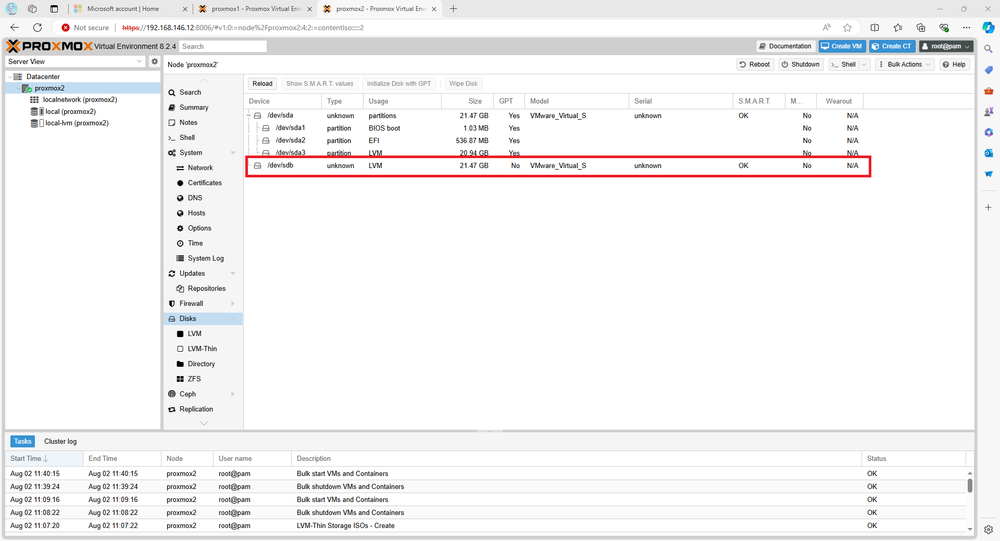

# An ISO directory

I have added a second disk to my VM and verified that it shows up as **/dev/sdb**.

<figure><figcaption></figcaption></figure>

I can then create a directory as a file store.

<figure><figcaption></figcaption></figure>

If I examine the directory, it allows me to create a range of file types.

<figure><figcaption></figcaption></figure>

If I examine /etc/pve/storage.cfg

```
dir: local
        path /var/lib/vz
        content vztmpl,iso,backup

lvmthin: local-lvm
        thinpool data
        vgname pve
        content images,rootdir

dir: ISOs
        path /mnt/pve/ISOs
        content backup,rootdir,iso,images,vztmpl,snippets
        is_mountpoint 1
        nodes proxmox2

```

If I only want this for ISOs, I can edit the content line.

